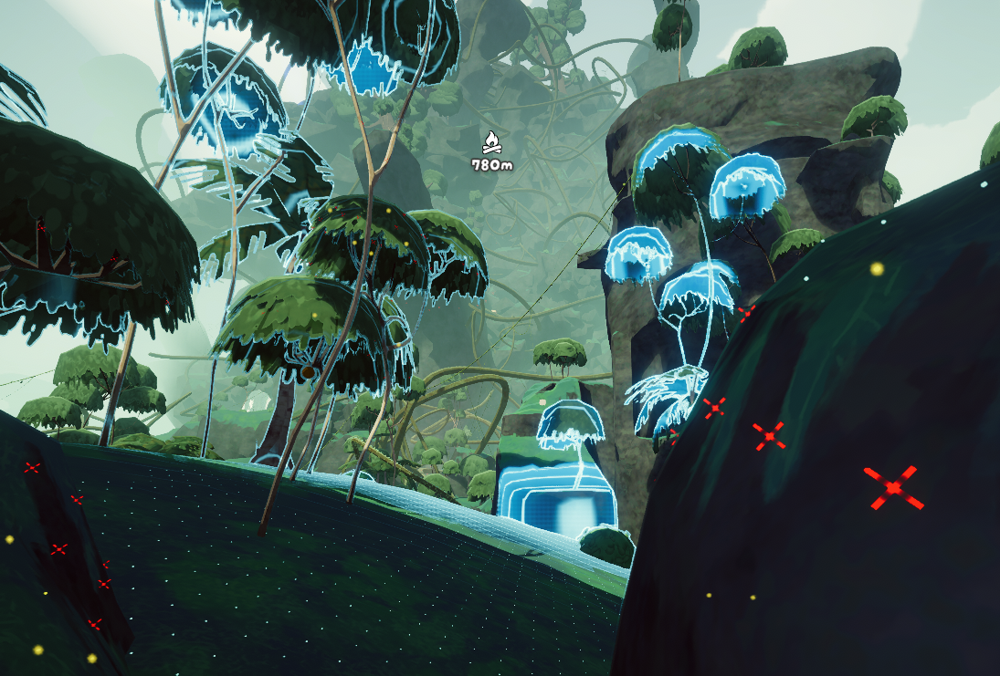

# TerrainScanner

PEAK 的地形扫描器 mod，基于 shader，由 GPU 渲染，采用异步逐帧采样，因此快速且不卡顿。

> 本项目最初从 [FengLvv/Death-stranding-scan](https://github.com/FengLvv/Death-stranding-scan) 移植而来。

## What it shows / 功能

Standability & slope classification（立足/坡面分级，按地形表面法线坡度判定，见 `ScanMarkRenderer`）：

| 坡度 | 判定 | 显示 |
|---|---|---|
| `< 40°` | 平缓，可站立 | **白点** |
| `40°–50°` | 中等坡度，可站但有风险 | **黄色警告** |
| `≥ 50°` | 陡坡，不可站立 | **红叉** |

- 相机视锥矩形采样：扫描点阵跟随镜头朝向（Yaw）与位置、不受俯仰影响，命中地表形成规整点阵。
- 扫描音效（可配置音量/冷却/提前量）、`cfg` 可视化增强与固定配置。

## 快速开始 Quick start

1. 源码位于本仓库根目录：`TerrainScanner.cs`、`Config.cs`、`DS/`、`Assets/`。
2. 在场景中把 `ActiveScan` 挂到某个 GameObject（例如玩家或相机）上。默认用 `F` 键触发（见 `ActiveScan.cs`）。
3. 运行时确保 `ScanConfig` 正确填充所需材质与粒子预制体：`scanMaterial`、`markMaterial`，以及可选的 `markParticle1/2/3`。

如果使用 BepInEx mod 加载器，插件可在启动时自动完成这些填充。

## 配置要点

大部分运行时可调项位于 `ScanConfig`（`Config.cs`），并通过 BepInEx 以 `d542Bb.TerrainScanner.cfg` 暴露给玩家。开发者可在代码中调整：

- `horizontalCount` / `verticalCount` — 视锥截面采样分辨率。
- `markIconSize` 与 `markSafeColor` / `markWarningColor` / `markDangerColor` — 标记大小与三色。
- `outlineWidth` / `outlineBrightness` / `outlineStarDistance` — 描边粗细与距离带。
- `scanCooldown` / `sfxVolume` — 扫描冷却与音效音量。

## 性能建议 Performance

- 采样分片执行（使用 `UniTask.Yield()` 避免阻塞主线程）。若提高分辨率，请考虑调小 `horizontalCount/verticalCount` 或降低采样频率。
- 可限制每帧上传到 GPU 的标记数量（例如只保留最近的 N 个标记或按坡面类别优先）。

## Troubleshooting

- 只有部分标记被渲染：确认 CPU 侧 `Marks` 结构与 HLSL `Marks` StructuredBuffer 布局一致（字段顺序/大小），`ComputeBuffer` 用 `Marshal.SizeOf(typeof(Marks))` 作 stride，且实例化 shader 不在片元阶段写 `SV_DEPTH`。
- 射线够不到高崖：增大 `sampling_originHeightOffset` 与 `sampling_maxDistanceShort`。

## 项目出处

### 引用来源

- **移植基础**：本 mod 的地形扫描方案（基于 shader、GPU 渲染、异步逐帧采样）移植自 [FengLvv/Death-stranding-scan](https://github.com/FengLvv/Death-stranding-scan)（**Tzebruh**，MIT）。
- **立足判定来源**：可站立/坡面分级（白点 / 黄色警告 / 红叉）复刻自 [Tzebruh/Foothold](https://github.com/Tzebruh/Foothold)（**Tzebruh**，MIT）。
- **代码来源仓库**：代码进一步整理自 [haruyuki/TerrainScanner](https://github.com/haruyuki/TerrainScanner)（原为 PeakMods 的 fork，内含聊天 mod 与地形扫描器 mod），仅取其中地形扫描器部分；原作者 **LLightJunction / LIghtJUNction**（MIT）。
- **目标游戏生态**：一个用于 **PEAK** 游戏的 mod，通过 **BepInEx** 加载；构建依赖请见 [TerrainScanner.csproj](TerrainScanner.csproj)。
- **贡献者/维护者**：**d542Bb**。

### 许可证说明（重要）

本仓库源码派生自上述 **MIT** 授权的代码（Tzebruh、LLightJunction），本仓库按 **GPL-3.0** 发布（见根目录 `LICENSE`，遵循最严格的许可证要求）。原始 MIT 版权行保留在 `LICENSE-MIT`。发布/分发时请注意：

- 保留原作者版权声明与署名。
- 修改版需显著标注改动或日期，整理与修复记录见 `CHANGELOG.md`。
- 本仓库插件标识统一为 `d542Bb.TerrainScanner`（`AssemblyName`），发布命名空间 `d542Bb`。

### 为什么重新开这个仓库

复制代码并单开仓库，主要有几个原因：

1. **历史太杂**：原仓库 `haruyuki/TerrainScanner` 的历史里塞入了大量与地形扫描器无关的内容——聊天 mod 及其本地化 / UI 相关文档、约 83 MB 的 shader 书籍参考资料（`building-quality-shaders-unity-main`）、移植来源的完整 Unity 工程（DOTween、UniTask 等第三方库）、无实际用途的工具脚本。
2. **原仓库存在需要修复的 bug**：为了能在独立的干净仓库中继续维护和修复问题，不受历史包袱拖累，并继续整理地形扫描器功能。
3. **原作者不再经常维护**：原作者已留言「抱歉，没人陪我玩 PEAK，这个 mod 可能不再频繁更新」提交更新可能难以得到响应。并且由于项目变动较大，也难以提交更新合并。

因此我们新建了一个空仓库，只推入裁剪后的代码（单次提交、不含大文件历史）。原仓库作为 `upstream` 保留，便于对照与回看。