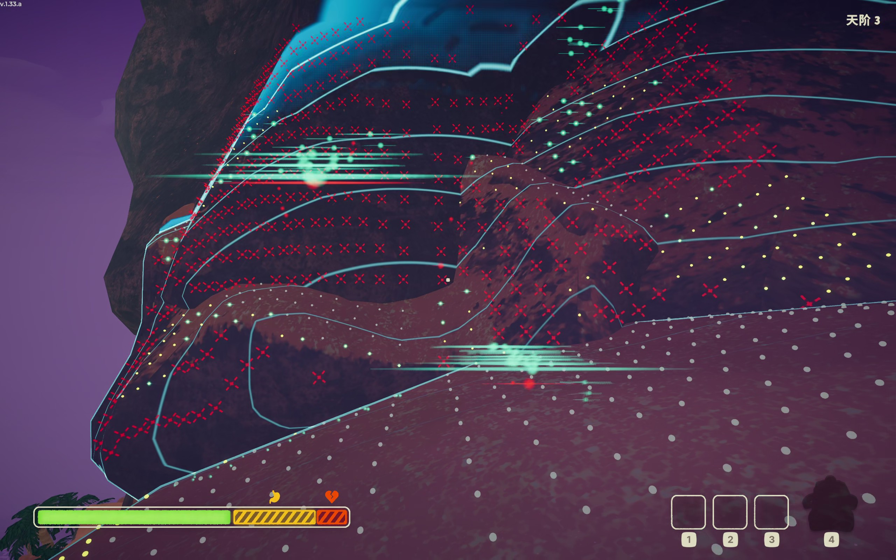

# TerrainScanner

Terrain scanner is based on shader and is rendered by GPU. And asynchronous frame rendering, so it is fast and not stuck.

---

## What it shows

- Slope classification (example thresholds used by the module):
  - Flat: 0°–30°
  - Gentle slope: 30°–50°
  - Steep: 50°–90°

These thresholds are configurable via `ScanConfig` (see below).

## Quick install / usage

1. Add the `TerrainScanner` scripts (or compiled DLL) into your Unity project's `Assets/` folder. The source is located in `src/TerrainScanner/` in this repository.
2. In your scene, attach `ActiveScan` to a GameObject (for example, the Player or Camera). By default the scanner is triggered with the `Q` key (see `ActiveScan.cs`).
3. Ensure `ScanConfig` is properly populated at runtime with the required materials and particle prefabs:

   - `scanMaterial` (shader for scan wave)
   - `markMaterial` (instanced shader for marks)
   - `markParticle1`/`markParticle2`/`markParticle3` (optional particle prefabs)

If you're using a mod loader (BepInEx) the plugin can populate these for you at startup.

## Configuration (important fields)

Most runtime options live in `ScanConfig` (`src/TerrainScanner/Config.cs`). Important values:

- `horizontalCount`, `verticalCount` — sampling grid size. Larger values increase coverage and precision but cost more CPU.
- `gridStep` — spacing between samples (meters).
- `sampling_originHeightOffset` — how far above the camera/player the ray origin starts. Increase this to scan higher terrain.
- `sampling_maxDistanceShort` / `sampling_maxDistanceLong` — raycast lengths for ground/ledge and long-range tests.
- `steepSpawnProb`, `midSpawnProb`, `flatSpawnProb` — per-category particle spawn probabilities.

Tune these values via the `ScanConfigManager` or by binding them in your plugin's initialization.

## Troubleshooting

- I see only some marks rendered even though scanning detected many hits:

  - Make sure the CPU-side `Marks` struct layout matches the HLSL `Marks` StructuredBuffer. Field order and sizes must match.
  - Ensure `ComputeBuffer` is created with the correct stride (use `Marshal.SizeOf(typeof(Marks))`).
  - Check the instanced shader does not write depth in the fragment stage (writing `SV_DEPTH` in the fragment can cause depth conflicts and hide instances). Move depth calculation to the vertex stage or remove manual depth writes.
- Rays don't reach high cliffs:

  - Increase `sampling_originHeightOffset` and `sampling_maxDistanceShort`.
- Performance concerns:

  - The sampling runs in slices (uses `UniTask.Yield()` to avoid blocking the main thread). If you increase resolution, consider reducing `horizontalCount/verticalCount` or lowering sample frequency.
  - Consider limiting how many marks are uploaded to the GPU per frame (e.g. keep only the nearest N marks or prioritize by slope category).

## Roadmap — Smarter Terrain Scanner (next major feature)

Planned: an "Intelligent Terrain Scanner" that improves scanning quality while staying performant. High-level goals and design notes:

1. Energy-based propagation model

   - Each discovered sample carries an energy budget (kinetic + potential). Propagation to neighbors consumes energy for distance traveled and for climbing.
   - Branching reduces energy (spawn cost). A cell is revisited only if arriving with strictly more remaining energy (best-energy rule).
2. Priority-driven exploration

   - Replace the plain FIFO propagation queue with a priority queue sorted by remaining energy (prefer uphill, higher-energy fronts) so the algorithm finds viable ascent routes sooner.
3. Quantized, memory-efficient state

   - Store per-cell discovered heights as quantized keys (e.g. 0.1m precision) in HashSets to avoid float equality problems and to reduce duplicates.
4. Safety & termination

   - Global processed-count cap and local energy thresholds to prevent runaway propagation in caves or dense geometry.
5. Runtime tuning and visualization

   - Expose energy parameters and propagation limits in `ScanConfig` so users can tune behavior.
   - Add an optional debug overlay to visualize propagation fronts, queued items, and per-cell best-energy values.

Why this helps:

- It prevents infinite propagation in complex geometry (caves/overhangs).
- It prioritizes realistic uphill routes, helping scans find reachable ground rather than flooding every neighboring cell.
- It keeps performance predictable and tunable.

## Contributing

Contributions, issues, and suggestions are welcome. When opening a PR:

- Explain the problem or feature and include screenshots or logs if relevant.
- Keep changes focused; large refactors are easier to review if split into smaller PRs.

## License

This project is licensed under the terms in `LICENSE`.

- 参考/灵感来源与早期版权：**Tzebruh**（MIT）——[FengLvv/Death-stranding-scan](https://github.com/FengLvv/Death-stranding-scan) 提供了移植基础。
- 原作者：**LLightJunction / LIghtJUNction**（MIT）。
- 本仓库源码派生自上述 MIT 授权的代码，按 **GPL-3.0** 发布（见仓库根目录 `LICENSE`）。
- 贡献者/维护者：**d542Bb**。
- 修改自 haruyuki/TerrainScanner（原 PeakMods fork），仅保留地形扫描器部分；改动记录见仓库根 `README.md` 与 `CHANGELOG.md`。

---
